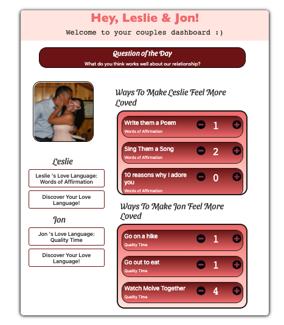
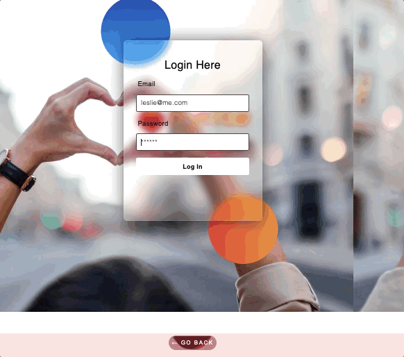

# Ignite

## Description
Maintaining a strong and healthy relationship can be a challenge when life gets busy, and as we grow and change as individuals. We created Ignite to help couples connect, communicate, and find new ways to make one another feel loved. <br />

Users will have access to a 'Question of the Day' that will spark conversation and allow for a deeper understanding of one another. Each partner will complete a questionnaire that will determine the primary way in which they feel loved. Once complete, a list will be displayed with ways for each partner to make the other feel more loved, based on their individual love language. 


## Table of Contents
* [Description](#description)
* [Demo and Site Link](#demo)
* [Installation](#installation)
* [Technology Stack](#technology-stack)
* [Code Snippets](#code-snippets)
* [Authors](#authors)
* [License](#license)

## Demo and Site Link
* [Ignite - Live Site](https://fierce-sands-31159.herokuapp.com/)
* [Ignite - Repo](https://github.com/lesliejpatino/Ignite)





## Installation
To run this application, there are many packages that must be installed. Once you are in the root directory, run the following script:

``` 
npm install
```

Once all dependencies are installed, view the application by running:
```
npm run develop 
```

## Technology Stack
Front End Technologies
* React
* Bootstrap
* CSS
* HTML 
<br />
<br />

Back End Technologies
* Node js
* Express
* Mongoose
* MongoDB (Database Management) 


## Authors
**[Pangta Huang]()**

* [Pangta's GitHub](https://github.com/willyhuang18)
* [Pangta's LinkedIn](https://www.linkedin.com/in/pangta-huang-2b7b0117a/)

**[Joshua Meza]()**

* [Joshua's GitHub](https://github.com/705h-S)
* [Joshua's LinkedIn](https://www.linkedin.com/in/joshua-meza-sinai/)

**[Elliot Park]()**

* [Elliot's GitHub](https://github.com/elliotpark410)
* [Elliot's LinkedIn](https://www.linkedin.com/in/elliot-park/)

**[Leslie Patino](https://lesliejpatino.github.io/LP-React-Portfolio/)**

* [Leslie's GitHub](https://github.com/lesliejpatino)
* [Leslie's LinkedIn](https://www.linkedin.com/in/lesliejpatino/)


## License
MIT License <br/>
[](https://opensource.org/licenses/MIT) <br/>
Copyright (c) 2022 Pangta Huang, Joshua Meza, Elliot Park, Leslie Patino
